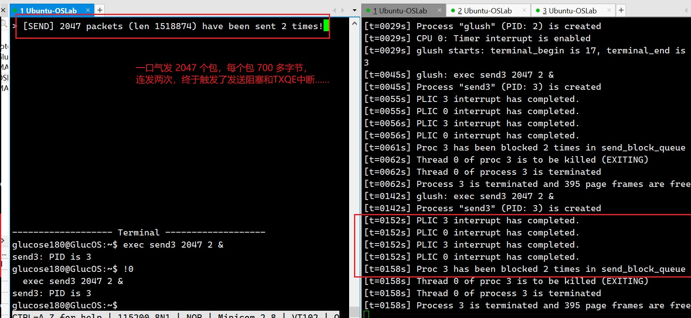

# GlucOS for UCAS-OS-Lab

### Branch: Project5-Device_Driver

#### 简介

  你说得对，但是 GlucOS 是由仲剑自主研发的一款全新开放的操作系统，程序可以运行在一个被称之为 RISC-V 64 的体系结构上。GlucOS 在不断成长，目前已经支持进程调度、同步通信、虚拟内存以及设备驱动功能，尚不支持文件系统。

  `README-0.md`是做的一些实验记录，主要是给自己看的。

#### 编译

  编辑`GlucOS-auto-make.sh`脚本文件，保持当前默认配置即可：

```bash
Multithreading=1
Timer_interval_ms=10
NCPU=2
NPF=51200
NPSWAP=512		# Number of swap pages
DEBUG=1
User_seg_max="0x800000"	# 8 MiB
UPROC_MAX=32	# Number of user processes
```

  然后，运行`bash ./GlucOS-auto-make.sh clean nodebug`，这将清掉已编译过的文件重新编译，并启用 -O2 优化选项。正常情况下不会有任何错误和警告。

  插入 SD 卡，然后`make floppy`将制作好的镜像写入。

#### 运行

  将 SD 卡插入 PYNQ 板卡，使用网线和 USB 数据线连接板卡和计算机，接通板卡电源，然后`make minicom`，`printlon`、`loadbootm`，即可启动 GlucOS。

  注：GlucOS 启动后，在初始化界面按任意一个按键可保持该界面的信息，直到按下下一个按键后继续。

##### 1. 网卡发包

  启动 Wireshark 软件侦听网卡，然后在 GlucOS 的终端 glush 中输入`exec send &`可发送简单的数据包（一次发送 4 个包，每个长 88 字节），在 Wireshark 中可看到相应的数据。

  可以换用测试程序 send2 来提高发送强度，具体做法为：`exec send2 5 &`，其中参数`5`代表重复发送 5 次，可以修改，且每次为 10 个包，这 10 个包的内容在源代码中以字符串常量的形式存在：

```c
const char *msg[10] = {
    "The train bound for Universal Resort is arriving!",
    "This train is bound for Universal Resort.",
    "The next station is Gongzhufen.",
    "Change here for Line 10.",
    "We are now arriving at Gongzhufen.",

    "The train is arriving, please mind the gap.",
    "This train stops service at Zhangguozhuang station.",

    "Buy tickets at 95306!",
    "Deliver goods at 12306!",
    "China railway wishes you a pleasant journey!"
};
```

  看到屏幕上打印出信息说发了 50 个包，并且从 Wireshark 可以读到与上述字符串一致的数据。

##### 2. 网卡收包

  为了避免用 Windows 导致的一些问题，建议从本步起让虚拟机捕获 USB 网卡并启用，然后在虚拟机中运行发包小程序 pktRxTx 对开发板发包。具体做法我已发在 issue 上，大概为：用虚拟机捕获 USB 网卡后在虚拟机中执行`ip add` 查看网卡名（假设是`enx00e04c6005b9`），然后`sudo ifconfig enx00e04c6005b9 up`将其启用，这样就可以使用虚拟机中的发包程序了。

  **注**：12 月14 日老师发布了修复后的发包小程序 pktRxTx，可以在 Windows 上正常使用了，同一天下文提到的`tools/fletcher16.c`也做了修复。

  使用`-m 1`选项运行发包程序 pktRxTx，选择 USB 网卡后进入交互界面。这时在 glush 中执行`exec recv &`，它每次收 32 个包，那就在发包交互界面里输入`send 32`试试。这时可在 GlucOS 的界面中看到收包情况。收包后用`kill`命令将 recv 终止掉即可。

  注意，由于测试程序 recv 的设计过于粗糙，它只能以固定的格式（十六进制）打印包的内容，且打印起来没完没了，而在连接网线后 PYNQ 板卡很容易收到一些杂音包，这将导致杂音包灌满整个屏幕，很难受。因此推荐用全新升级改版的 recv2 进行测试。

  recv2 的运行格式为：`exec recv2 -n[NPKT] -l[LLIM] [-c] &`。每个参数都是可选的。`[NPKT]`可指定一次收包数，默认为 32；`[LLIM]`可指定打印限制，即最多打印每个包的多少个字节；`-c`选项可使程序以字符形式而不是十六进制格式打印。

  推荐的运行参数为：`exec recv2 -n72 -l80 -c &`。这将一次接收 72 个包，最多打印 80 个字符。72 已经超出了驱动程序的接收队列缓冲区大小（宏`RXDESCS`，默认 64），符号测试要求。运行后，在发包小程序中输入`send 72`，然后看 recv2 的收包情况即可。

```bash
[RECV] start recv(72): 11876, iteration = 1
packet 71: len 71 
..5..S..[3V...E..9.1@.@.\K...C.....R.@........P.
..JM..Requests: 35(^_^).5..S....
```

  “len”后面的是当前包的长度，71 是正常的，如果明显多于这个数那估计意味着该包是杂音包。正常的包里面可以看到有可读信息（一个编号和一个字符表情）“Requests: 35(^_^)”，这大概是发包程序发出去的。

  测试完成后用`kill`命令将其终止即可。

##### 3. 网卡中断

  发送阻塞和 TXQE 中断是很难触发的，因为网卡发包太快了，远比 GlucOS 快。如非要测试，可修改源代码文件`e1000.h`中`TXDESCS`的定义为 2048，然后`bash ./GlucOS-auto-make.sh clean`（不要加`nodebug`，否则看不到日志）重新编译，运行后启动超强测试程序 send3：`exec send3 2047 2 &`，这将连续发送 2 次，每次发送 2047 个长达 742 字节的包，这样就有可能触发发送阻塞和 TXQE 中断，在日志文件`glucos-fpga.log`中可看到相应信息。过于繁琐，不建议尝试，因此我附上了一张效果图如下。



  接收阻塞和 RXDMT0 中断其实在上一部分测试收包的时候就已经验证了，因此没必要专门测试。

##### 4. 可靠传输

  请使用 recv3 测试程序来测试可靠传输功能。其用法为`exec recv3 -l[LEN] [-h] [-c] [-ch] [-p[PLOC]] &`。每个参数都是可选的，`[LEN]`代表一次接收的长度，`-h`、`-c`、`-ch`分别为以十六进制、字符、字符（支持中文但不太好）格式打印，`[PLOC]`用来指定打印接收到的数据的屏幕区域底端坐标（用于自动滚屏），默认为 15。

  首先可就地取材尝试传输`riscv.lds`文件，**请先查看其大小**，假设为 7105 字节，那么请执行`exec recv3 -l7109 -c &`。注意，**长度参数应为文件大小加上 4**，因为发包程序会在前面附上 4 个字节的长度信息。然后以`-m 5 -f ./riscv.lds -l 10 -s 50`（10 和 50 为丢包率和乱序比例，可适当修改，也可不加）为参数在 Linux 虚拟机中运行发包程序，选择 USB 网卡后即可看到传输情况，在 GlucOS 中的 recv3 将打印文件内容，并最后打印出计算的 Fletcher 校验和。为了验证，可编译运行`tools/fletcher16.c`，将文件名`riscv.lds`作为命令行参数传入，即可自动计算其 Fletcher 校验和进行比对。

  注：如果不想费时间打印接收到的文件内容，可在运行 recv3 时不加`-c`、`-h`、`-ch`选项的任何一个，这将在接收到数据后只打印最后的校验和。测试完后记得终止 recv3 进程。接收二进制文件也是可以的，但就是不要再开启打印了，看一下校验和就可以说明正确性了，最大测试过 100 KiB 左右的二进制文件（没错，发送的正是发包程序本身）。

  **为了玩耍**，可尝试一下发送带中文字符的文件。查看文件`锦瑟长思-银临.lrc`（这是某首不知名的歌曲的词，用于纪念我在学校今年迎新晚会上的表演：https://www.bilibili.com/video/BV13C4y137wM/?share_source=copy_web&vd_source=57c94c86379d7a1a5019f018fb985338）的大小，假设为 1984 B。然后，`exec recv3 -l1988 -ch &`运行 recv3，然后以`-m 5 -f ./锦瑟长思-银临.lrc -l 10 -s 40`运行发包程序，这将在 GlucOS 中看到奇怪的中文打印现象（是我魔改后的屏幕驱动程序不完善，对中文支持不好导致的）……但最后打印出的校验和是对的，说明确实是屏幕显示的问题而不是接收的问题。

  **Project 5 到此告一段落，更多精彩请期待下一个实验……**